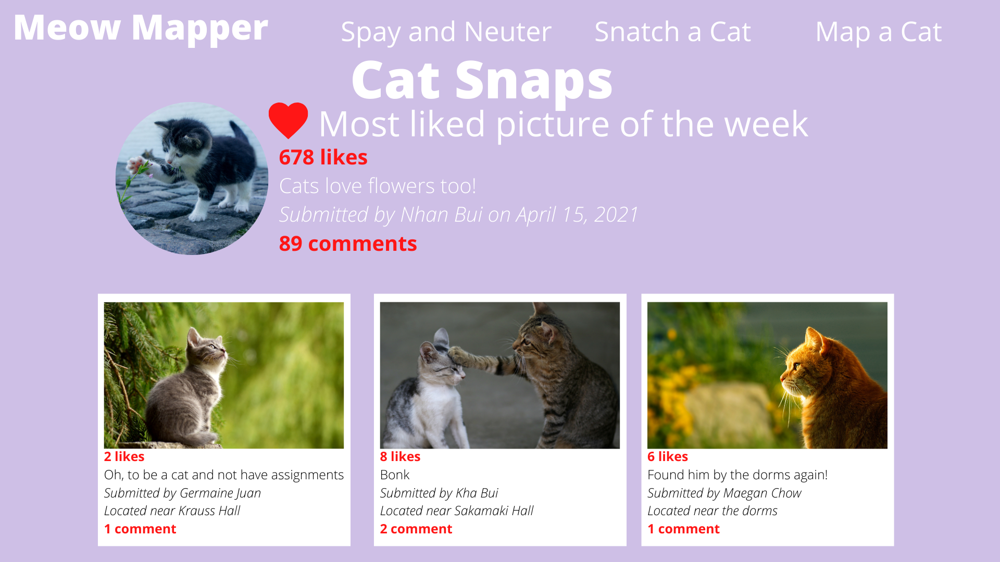
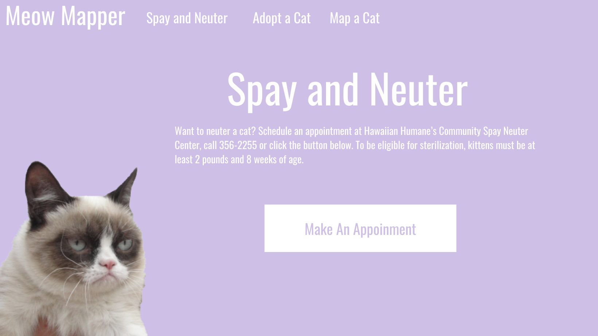
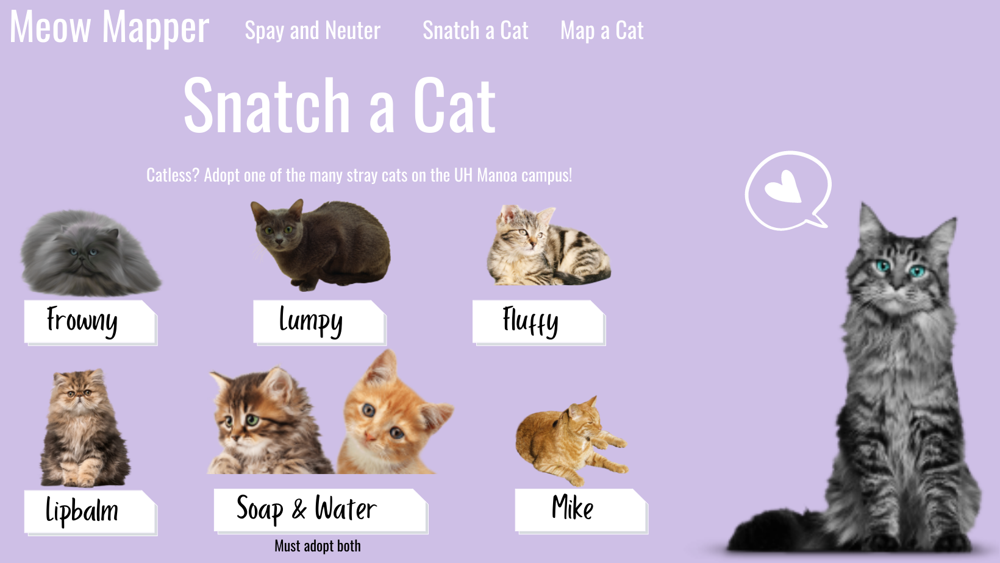
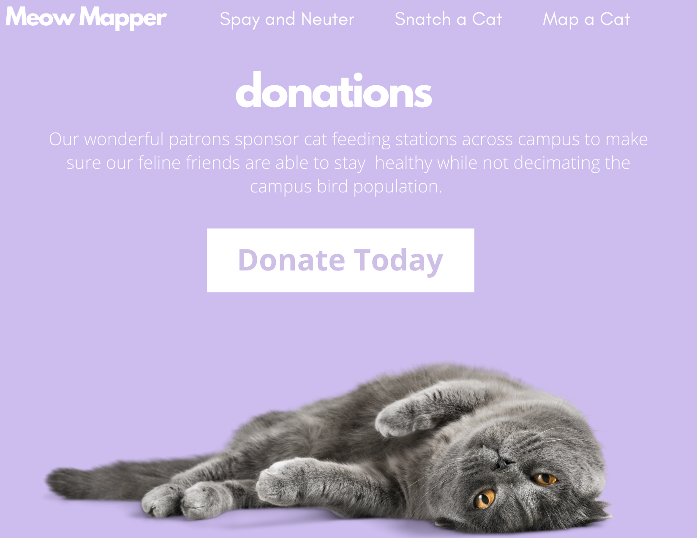

## Table of Contents

* [Goal of this Project](#goal-of-this-project)
* [Deployment](#deployment)
* [User Guide](#user-guide)
* [Community Feedback](#community-feedback)
* [Developer Guide](#developer-guide)
* [Development History](#development-history)
* [Contact Us](#contact-us)

## Goal of the Project

The goal of this project is to address the many stray cats on UH Manoa's campus. "Meow Mapper" will allow users to track cats and see which have been fed/provided with veterinary care and which have not. 

## Deployment

A live deployment is available at https://meowmapper.com/

## User Guide

### Landing Page

The landing page is the first page presented to users when they visit the URL to the site. A navbar with more options will be available on logging in. 

### Cat Pictures Page

This page is where users can share pictures of the cats they see around campus. 

### Login Page

This is the page a user sees directly after logging in. A personal feed that the user can change based on their specific goals for using the website.

### Spay-and-neuter Page

This is the page that is run in affiliation with the Humane Society with the end goal of less stray cats on campus. 

### Snatch-a-cat Page

This is the page that where users can go to choose a cat to adopt. 

## Donations

Users can provide donations to contribute to feral cat feeding stations around campus.

## Community Feedback

We would love to hear from our users! Please feel free to contact us with ideas for improvement. 

## Developer Guide

TBA after the project is finished.

## Development History

Milestone 1: 4/15/2021
- Website functionality confirmed
- Mockups for pages finalized
- Landing page created
- https://github.com/meow-mapper/meow-mapper/projects/1

Milestone 2: 4/27/2021
- https://github.com/meow-mapper/meow-mapper/projects/2

## Contact Us

The developers of this project are Kha Bui, Nhan Bui, Germaine Juan, and Maegan Chow.

