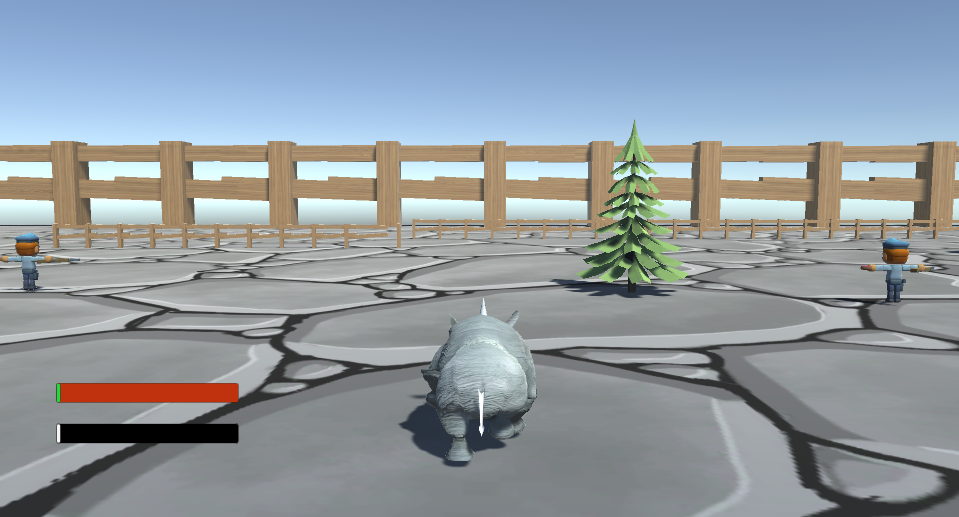
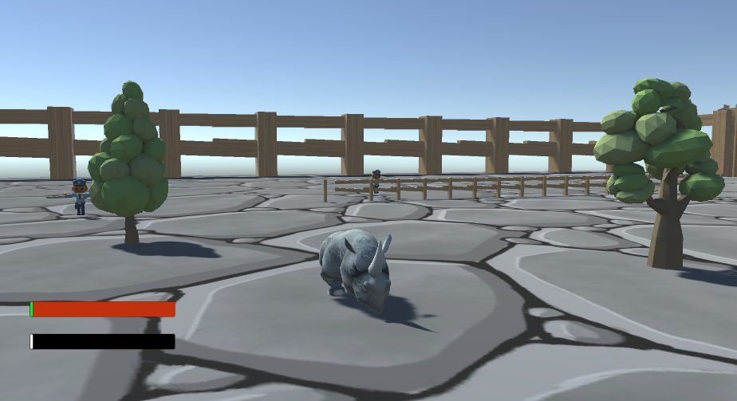
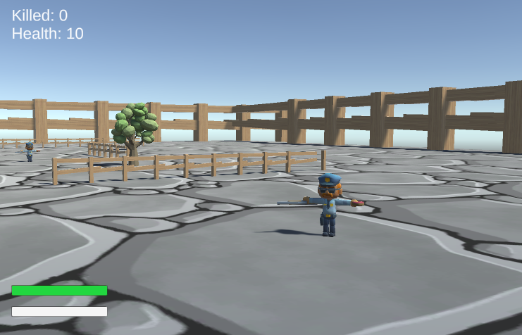
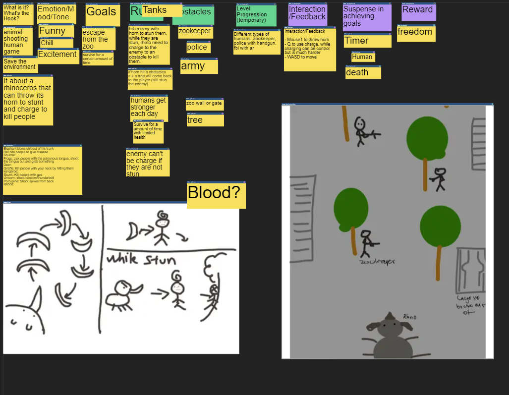

# Welcome to Rhinocerous
The animals of the zoo are sick of being locked. They are starting a revolutio and leading the charge are the rhinocerous. Rhinocerous is an adventure game following a rhinocerous's adventure to breaking free starting first with the zoo and then the world!

# Team Members

Nhan Bui (ISC)

Nhan Bui created the spawners for the enemies and obstacles, the charging UI and stamina system, worked on the camera angle, and the menu and how to play screens. 

Shengtong Jin (ICS)

Su Lao (ICS)

## Table of Contents

* [Rhinocerous Demo and Trailer](#rhinocerous-demo-and-trailer)
* [Game Engine](#game-engine)
* [User Guide](#user-guide)
* [Community Feedback](#community-feedback)
* [Developer Guide](#developer-guide)
* [Development History](#development-history)
* [Contact Us](#contact-us)

## Rhinocerous Demo and Trailer

If you would like to view a demo of our game, click here(https: link here ).
If you would like to view a trailer of our game, click here(https: link here ).

## Game Engine

The game is created entirely using Unity and all asets are from the Unity store. The player can use WD to move backward and forward, the mouse to control forward direction, Q to charge, and AD to control the direction of charging. 

Rhinocerous in-game shots:

Game-view: This is the view of the rhino that the players see. The horn will detach and fly at an enemy when the left mouse is clicked. If it hits an enemy it will stunt them.

Front-view: This is what the rhino looks like from the front

Enemy in-game shots:

Regular Enemy: These enemies can be killed using the rhino horn or when pushed upon another object.

Shield Enemy: These enemies can only be killed after they are stunt by the horn.

Tank Enemy: The tank enemies can only be killed when another enemy is charged onto it. 

## Current Game State

- Character movement finished
- Character model completed
- Map 1 finished
- Basic funtionality of enemies created

## Future Updates

- Character animation
- Enemy animation
- New map
- New enemies

## Our Sage Board

View our trello board [here](https://trello.com/rhinocerosgame)
