## Table of Contents

* [Goal of this Project](#goal-of-this-project)
* [Deployment](#deployment)
* [User Guide](#user-guide)
* [Community Feedback](#community-feedback)
* [Developer Guide](#developer-guide)
* [Development History](#development-history)
* [Contact Us](#contact-us)

## Goal of the Project

The goal of this project is to address the many stray cats on UH Manoa's campus. "Meow Mapper" will allow users to track cats and see which have been fed/provided with veterinary care and which have not. 

## Deployment

A live deployment is available at [https://meowmapper.com/](https://meowmapper.com/)

## User Guide

### Landing Page

The landing page is the first page presented to users when they visit the URL to the site. A navbar with more options will be available on logging in. 

### Login Page

This is the page a user sees directly after logging in. A personal feed that the user can change based on their specific goals for using the website.
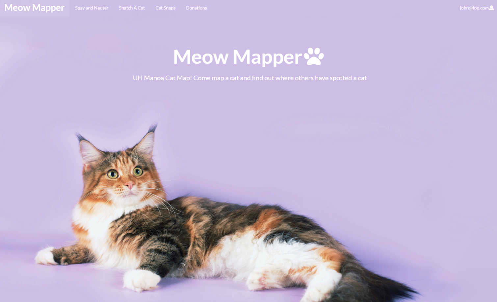

### Cat Pictures Page

This page is where users can share pictures of the cats they see around campus. 

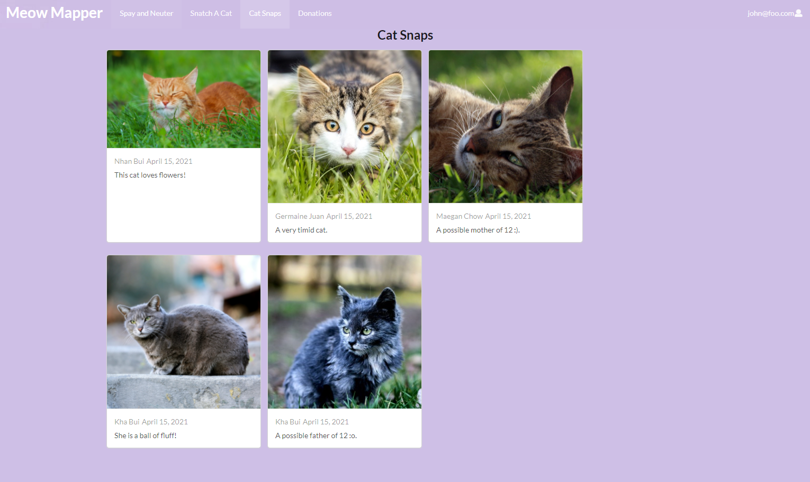

### Spay-and-neuter Page

This is the page that is run in affiliation with the Humane Society with the end goal of less stray cats on campus. 
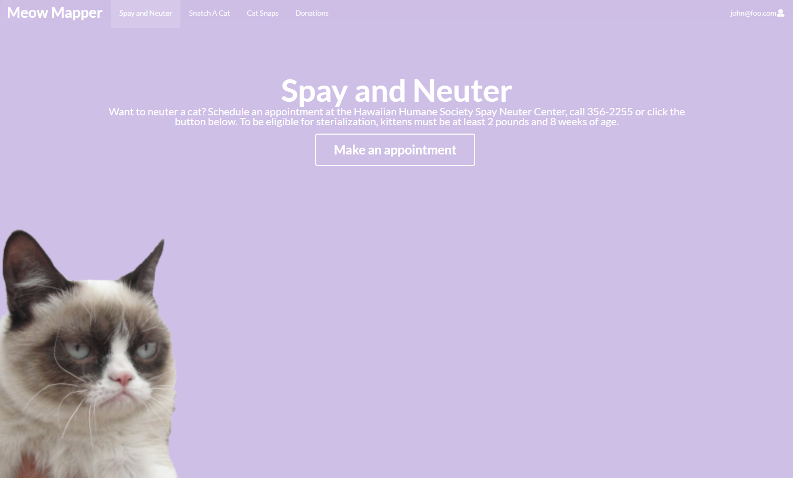

### Snatch-a-cat Page

This is the page that where users can go to choose a cat to adopt. 
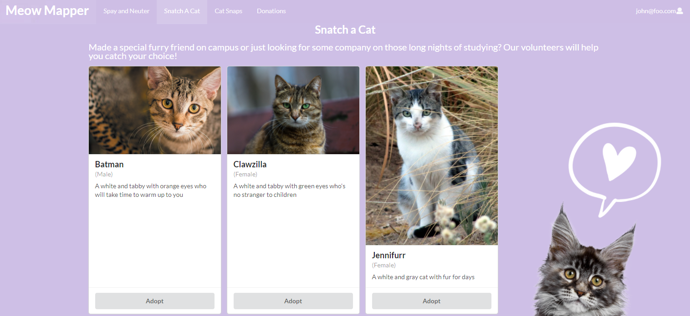

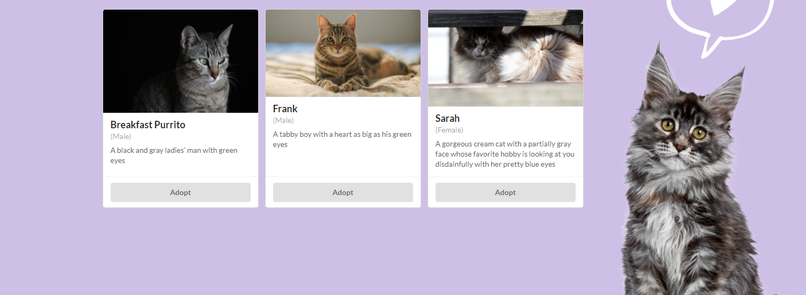
### Donations

Users can provide donations to contribute to feral cat feeding stations around campus.
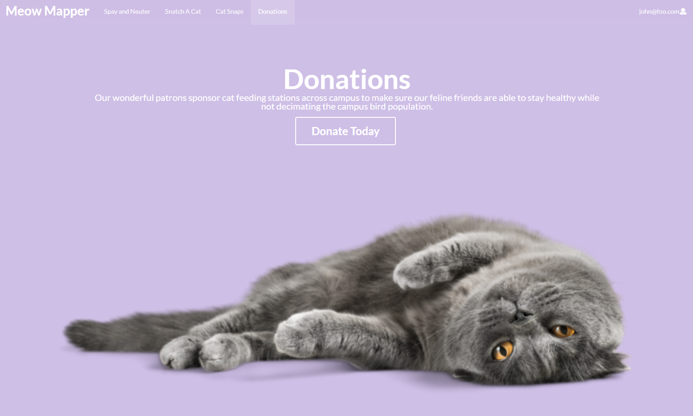

## Admin

## Community Feedback

We would love to hear from our users! Please feel free to contact us with ideas for improvement. 

"The concept of this website is very nice and good for the community. The formatting of the sub headings are perfect with the right order. The formatting of the pictures and the description was excellent and fun to look at. I would definitely click on this website again." -Sara Vu

"Upon my initial impression, I was obsessed with the simple cat themed asthetics portrayed, it's so  cute! The spay and neuter page is a little off to me because it does not fit well with the overall purpose of the website althought it is useful." -Toni Tang

"This website is very cute. I love the idea of knowing where all the cats on campus are. I also really liked the little name cards that each of the cats have, I would like some more descriptions about the cats though. Overall I think it is a good website." -Valerie Eng

"The minimalistic design is very nice to look at but the website is lacking a little bit of functionality," - Angelica Fajardo

"Very nice." - Darin Yukumoto

## Developer Guide

### Installing 

First, install [Meteor](https://www.meteor.com/developers/install).

Second, go to [https://github.com/meow-mapper/meow-mapper-deploy](https://github.com/meow-mapper/meow-mapper-deploy) and download the masters.

Third,  go to your newly created repository, and click the “Clone or download” button to download your new GitHub repo to your local file system. Using GitHub Desktop is a great choice if you use MacOS or Windows.

Fourth, cd into the app/ directory of your local copy of the repo, and install third party libraries with:
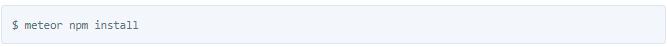

### Running the system
Once the libraries are installed, you can run the application by invoking the “start” script in the package.json file:
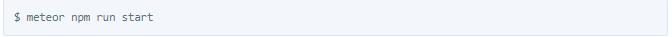
The first time you run the app, it will create some default users and data. Here is the output:

### Note regarding “bcrypt warning”:
You will also get the following message when you run this application:

On some operating systems (particularly Windows), installing bcrypt is much more difficult than implied by the above message. Bcrypt is only used in Meteor for password checking, so the performance implications are negligible until your site has very high traffic. You can safely ignore this warning without any problems during initial stages of development.

### Note regarding “MongoError: not master and slaveOk=false”:
Intermittently, you may see the following error message in the console when the system starts up:
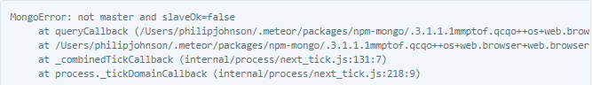
While irritating, this message appears to be harmless and possibly related to a race condition between the development instance of Mongo and Meteor. By harmless, I mean that in most cases, the console goes on to display App running at: http://localhost:3000/ and no problems occur during run time.

### Viewing the running app
If all goes well, the template application will appear at [http://localhost:3000](http://localhost:3000). You can login using the credentials in settings.development.json, or else register a new account.

###ESLint
You can verify that the code obeys our coding standards by running ESLint over the code in the imports/ directory with:
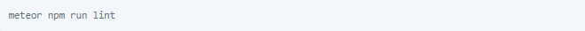

### Walkthrough
The following sections describe the major features of this template.

#### Directory structure
The top-level directory structure is:

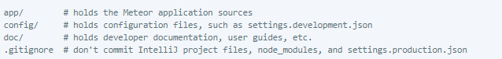
This structure separates documentation files (such as screenshots) and configuration files (such as the settings files) from the actual Meteor application.

The app/ directory has this structure:

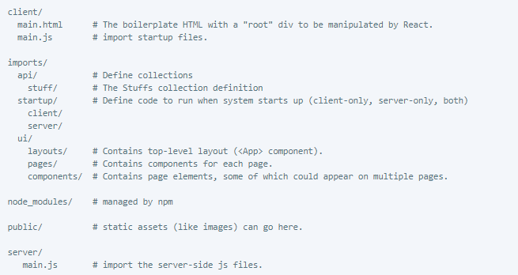

#### Import conventions
This system adheres to the Meteor guideline of putting all application code in the imports/ directory, and using client/main.js and server/main.js to import the code appropriate for the client and server in an appropriate order.

#### Application functionality
The application implements a simple CRUD application for managing “Stuff”, which is a Mongo Collection consisting of a name (String), a quantity (Number), and a condition (one of ‘excellent’, ‘good’, ‘fair’, or ‘poor’).

By default, each user only sees the Stuff that they have created. However, the settings file enables you to define default accounts. If you define a user with the role “admin”, then that user gets access to a special page which lists all the Stuff defined by all users.

## Development History

[Milestone 1:](https://github.com/meow-mapper/meow-mapper/projects/1) 4/15/2021
- Website functionality confirmed
- Mockups for pages finalized
- Landing page created

[Milestone 2:](https://github.com/meow-mapper/meow-mapper/projects/4) 4/27/2021
- Create working webpages
- Implement github actions
- Implement TestCafe "availability" tests for all pages

[Milestone 3:](https://github.com/meow-mapper/meow-mapper/projects/3) 5/4/2021
- Get community feedback on our webpage

## Contact Us

The developers of this project are Kha Bui, Nhan Bui, Germaine Juan, and Maegan Chow.

